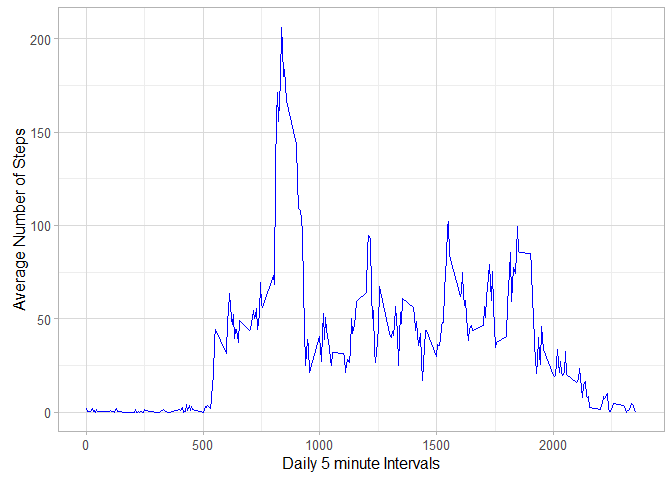

# Reproducible Research: Peer Assessment 1


## Loading and preprocessing the data

The data for this assignment can be downloaded and unzipped by

```r
fileUrl<-"https://d396qusza40orc.cloudfront.net/repdata%2Fdata%2Factivity.zip"
#download.file(fileUrl,"activity.zip")
#unzip("activity.zip")
```
It has also been included in the [GitHub repository](https://github.com/emperoraugust/RepData_PeerAssessment1) of the project. 

Unzipping activity.zip you obtain the dataset *activity.csv*, whose variables are:

- **steps**: Number of steps taking in a 5-minute interval (missing values are coded as NA)
- **date**: The date on which the measurement was taken in YYYY-MM-DD format
- **interval**: Identifier for the 5-minute interval in which measurement was taken

I load the dataset in R and I inspect its structure

```r
activity<-read.csv("activity.csv",colClasses = c("numeric","Date","numeric"))
names(activity)
```

```
## [1] "steps"    "date"     "interval"
```

```r
head(activity)
```

```
##   steps       date interval
## 1    NA 2012-10-01        0
## 2    NA 2012-10-01        5
## 3    NA 2012-10-01       10
## 4    NA 2012-10-01       15
## 5    NA 2012-10-01       20
## 6    NA 2012-10-01       25
```

```r
tail(activity)
```

```
##       steps       date interval
## 17563    NA 2012-11-30     2330
## 17564    NA 2012-11-30     2335
## 17565    NA 2012-11-30     2340
## 17566    NA 2012-11-30     2345
## 17567    NA 2012-11-30     2350
## 17568    NA 2012-11-30     2355
```


## What is mean total number of steps taken per day?
In this part I ignore the NA values and I consider the sumSteps, in which I have stored the total number of  steps taken per day:


```r
sumSteps<- aggregate(steps ~ date, activity, sum,na.rm=TRUE)
colnames(sumSteps)<-c("date","steps")
```

I make a histogram of the total number of steps taken each day and I compute its mean and its median (I use the ggplot2 package, so the first line downaload this package if it is not installed)


```r
if (!require("ggplot2")) install.packages("ggplot2")
```

```
## Loading required package: ggplot2
```

```r
library(ggplot2)
q<-qplot(sumSteps$steps,
      geom="histogram",
      binwidth = 5000,
      main = "Histogram for total number of steps per day",
      xlab = "Total number of steps",
      fill=I("steelblue"),
      col=I("blue"))+theme_light()
print(q)
```


```r
m<-mean(sumSteps$steps)
med<-as.integer(median(sumSteps$steps))
```


The **mean** of total number of steps taken per day is  1.0766189\times 10^{4}.
The **median** of total number of steps taken per day is 10765.


## What is the average daily activity pattern?

I make a time series plot of the 5-minute interval (x-axis) and the average number of steps taken, averaged across all days (y-axis)


```r
meanSteps<-aggregate(steps ~ interval, activity, mean, na.rm=TRUE)
colnames(meanSteps)<-c("interval","steps")
q<-ggplot(meanSteps, aes(x = interval, y = steps, group=1)) + 
      geom_line(colour="blue")+
      xlab("Daily 5 minute Intervals") +
      ylab("Average Number of Steps") + 
      theme_light()
print(q)
```



```r
rowMaxStep<-which(meanSteps$steps == max(meanSteps$steps))
maxInterval<-meanSteps$interval[rowMaxStep]
```

The interval that contains the maximum number is the interval 835


## Imputing missing values

There are some NA values in the data set. I take a look at the numbers of NA values


```r
 totalRow<-nrow(activity[is.na(activity$steps),])
```
There are 2304 NA values in a total of 17568 rows.

The strategy, used for filling in all of the missing values in the dataset, consists to replace NA with the mean for that 5-minutes interval.


```r
newData<-activity
index<-which(is.na(newData$steps))
newData$steps[index] <- meanSteps$steps[meanSteps$interval==newData$interval[index]]
```


I make a histogram of the total number of steps in  taken each day in the new Data set and I compute its mean and its median 


```r
sumSt<- aggregate(steps ~ date, newData, sum)
colnames(sumSt)<-c("date","steps")

if (!require("ggplot2")) install.packages("ggplot2")
library(ggplot2)
q<-qplot(sumSt$steps,
      geom="histogram",
      binwidth = 5000,
      main = "Histogram for total number of steps per day",
      xlab = "Total number of steps",
      fill=I("steelblue"),
      col=I("blue"))+theme_light()
print(q)
```


```r
mm<-mean(sumSt$steps)
medd<-median(sumSt$steps)
```


The **mean** of total number of steps taken per day is  1.0766189\times 10^{4}.
The **median** of total number of steps taken per day is 10765.

This values don't differ to the other values when I have excluded the NA values.

## Are there differences in activity patterns between weekdays and weekends?


```r
# I'm italian 
Sys.setlocale("LC_TIME", "English")
```

```
## [1] "English_United States.1252"
```

```r
weekend<-weekdays(newData$date)=="Saturday" | weekdays(newData$date)=="Sunday"
newData$day[weekend]<-"weekend"
newData$day[!weekend]<-"weekday"
newData$day <- as.factor(newData$day)
```

See the new data frame


```r
head(newData)
```

```
##       steps       date interval     day
## 1 1.7169811 2012-10-01        0 weekday
## 2 0.3396226 2012-10-01        5 weekday
## 3 0.1320755 2012-10-01       10 weekday
## 4 0.1509434 2012-10-01       15 weekday
## 5 0.0754717 2012-10-01       20 weekday
## 6 2.0943396 2012-10-01       25 weekday
```

```r
table(newData$day)
```

```
## 
## weekday weekend 
##   12960    4608
```


```r
meanIntSteps <- aggregate(newData$steps, by = list(newData$day, newData$interval), mean, na.rm=TRUE)
names(meanIntSteps)<-c("day","interval","steps")

ggplot(meanIntSteps, aes(x = interval, y = steps,group = 1)) +
    geom_line(color="blue") +
    xlab("Daily 5 minute Intervals") +
    ylab("Average Number of Steps") + 
    facet_grid(day ~ .)+
      theme_light()
```


It seems that the person start to walk later in the weekend that the weekdays. Besides during the weekday he walk more time at start of the day, whereas during the weekend the person's walk is non regular during all the day.
